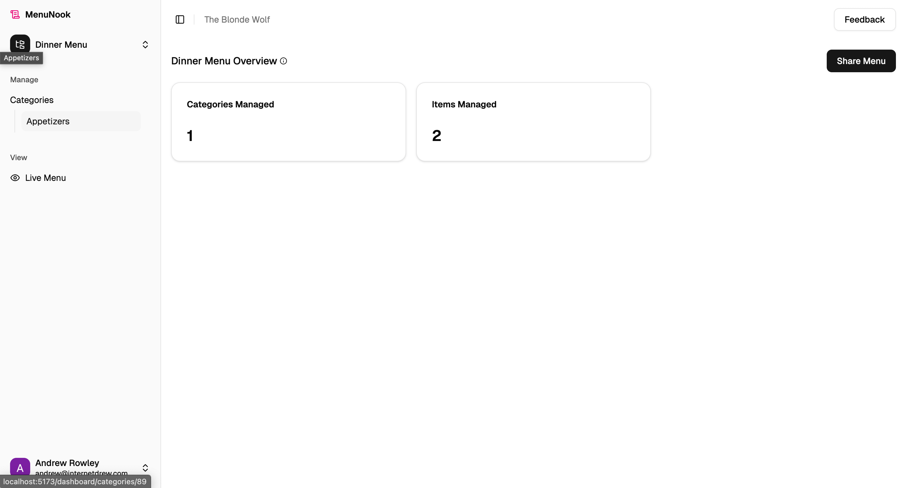
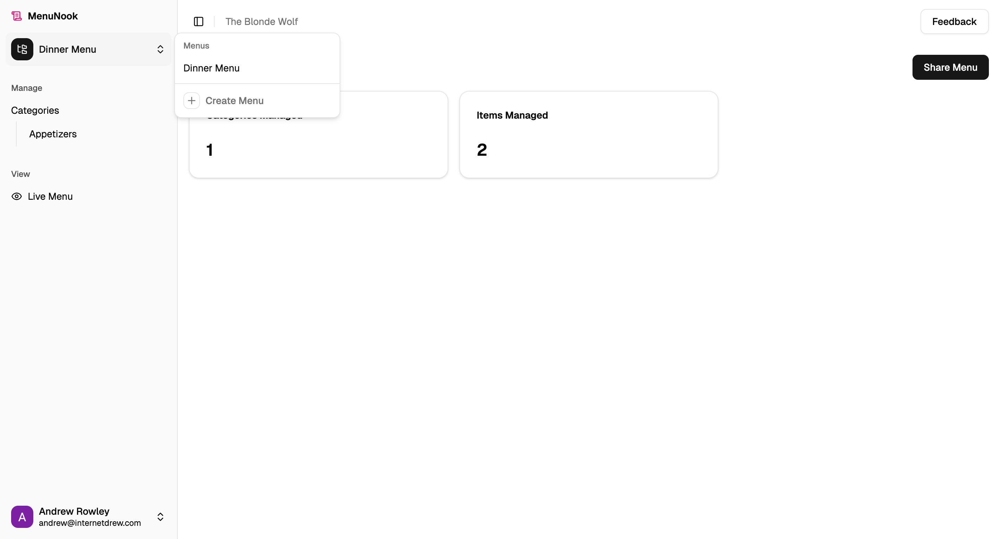
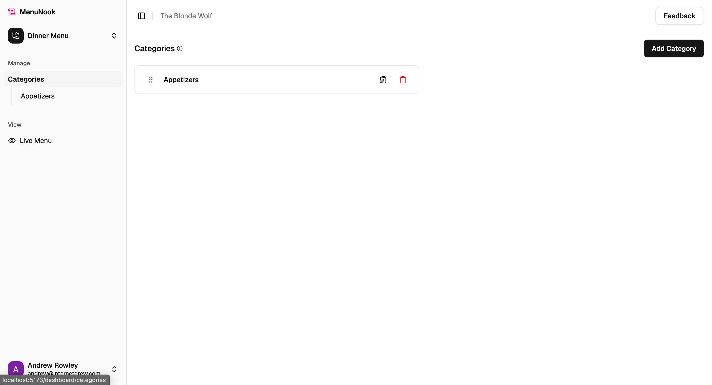
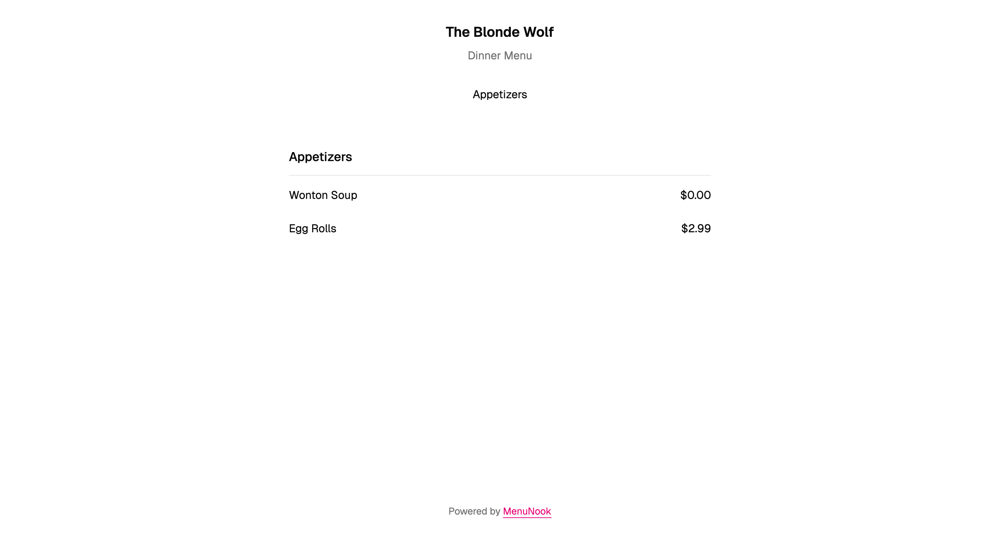
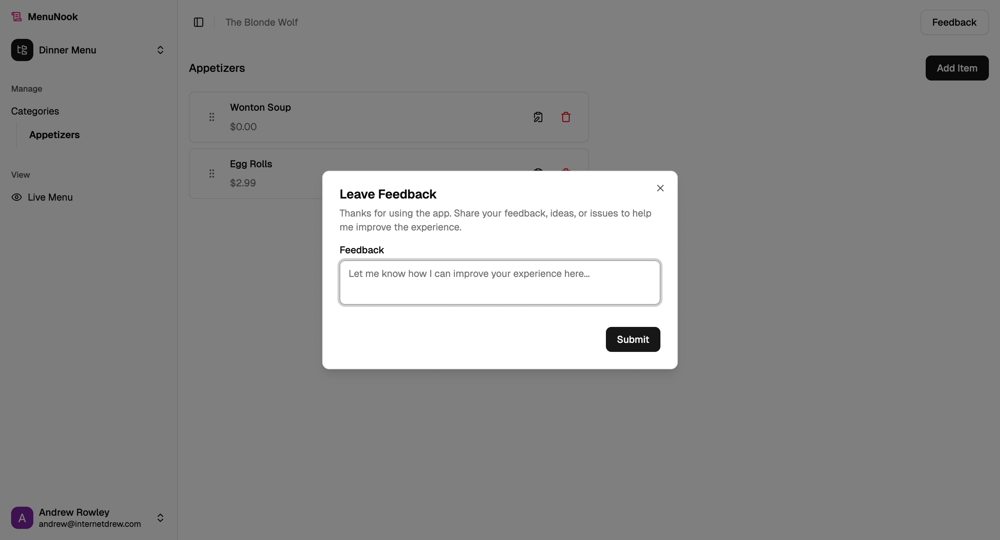
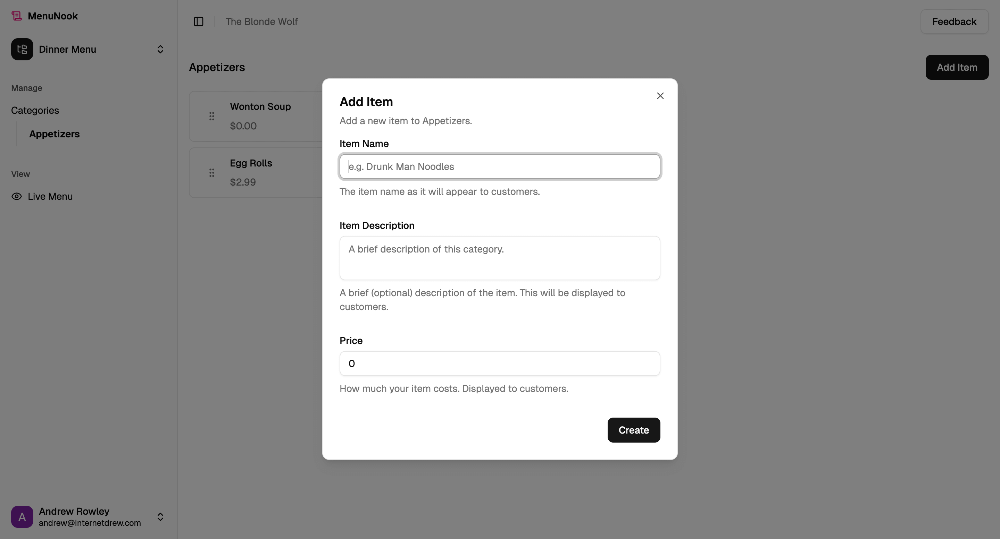
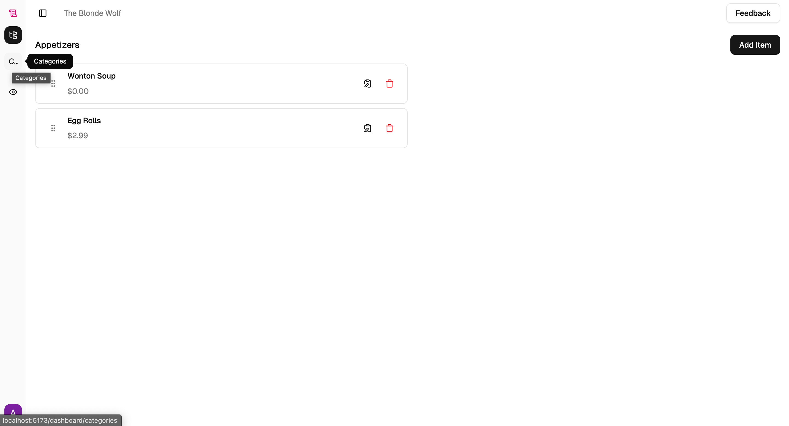
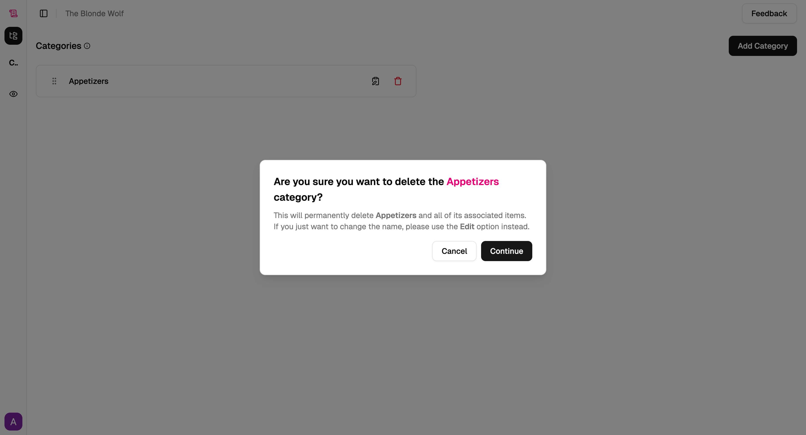

# MenuNook

A simple, lightweight menu app built for pop-up sellers and small batch makers.

Customers get a clean, always up-to-date view of what you're offering, accessible via QR code or link.

## Why MenuNook?

- Launch-ready in minutes: set up a polished menu without touching code, design tools, or domains.
- Built for pop-ups and makers: swap items or prices mid-service and updates are live instantly.
- Frictionless sharing: every menu has a link and QR that customers can scan from flyers, receipts, or table tents.
- Mobile-first by default: clean, distraction-free layout that keeps the focus on your offerings.

## Features

- Build multiple menus per business, organized by categories with names, blurbs, and optional images.
- Add items in seconds with names, prices, descriptions, and photos when you have them.
- Reorder categories and items without breaking links.
- Each menu auto-generates a shareable link and printable QR.
- Customer view is mobile-first and distraction-free.
- Manage from phone or laptop and update instantly for customers.

## Screenshots

## Tech Stack

- Frontend: Vite + React 19 with TypeScript, React Router 7, shadcn/ui (Radix), Tailwind CSS, and dnd-kit for drag-and-drop ordering.
- Data layer: tRPC (client + server) paired with TanStack Query for caching and mutations.
- Backend: Express with tRPC handlers, Supabase for auth/database/storage, and Stripe for billing.
- Testing: Vitest with Testing Library (React, DOM, user-event), jsdom test environment, and MSW for API mocking.
- Tooling: ESLint, Prettier, tsx, nodemon, concurrently, and Tailwind merge utilities.
